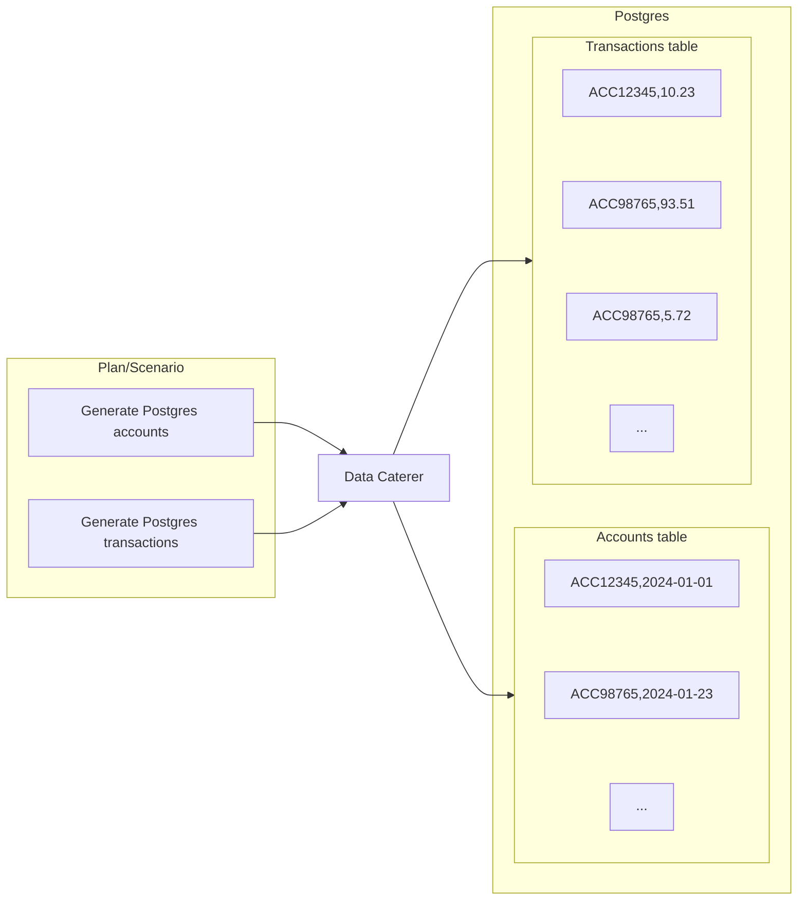
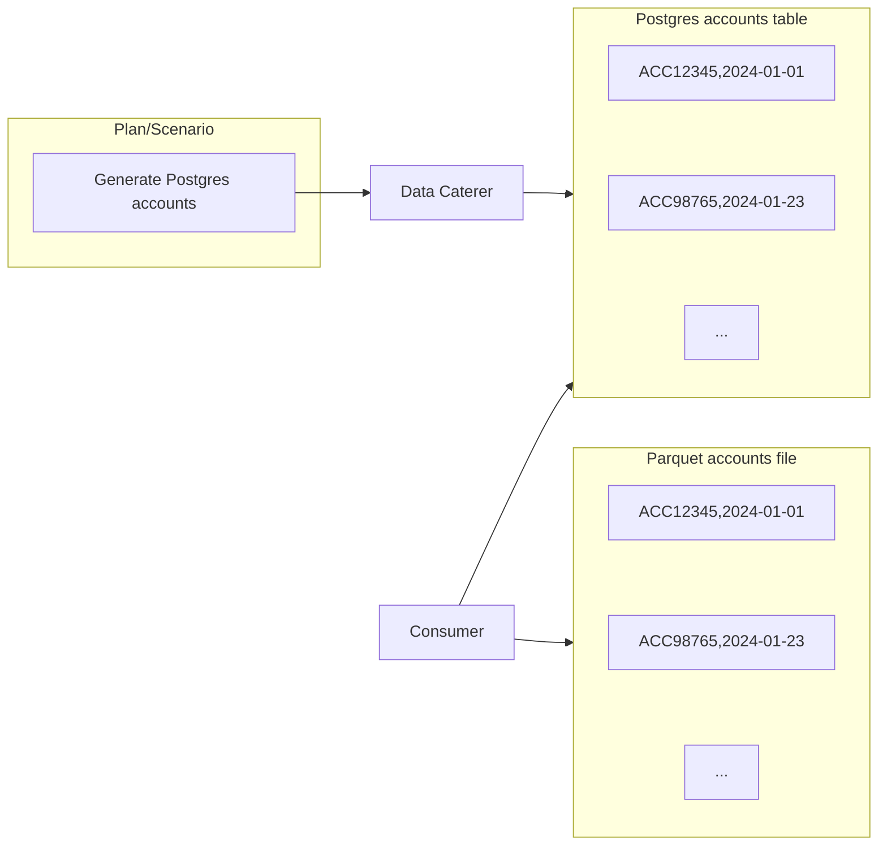

# Delete Generated Data

As you generate and validate data, you may want to clean up the data that has been generated. This helps you:

1. Keep your test environments clean
2. Reduce chance of existing data interacting with your validations
3. Creates a simple workflow for developers and testers to follow

## Foreign Keys/Relationships

You can either define a foreign key for data generation (i.e. create same account numbers across accounts and
transactions table)
or for data deletion (i.e. account numbers generated in Postgres are consumed by a job and pushed into a Parquet file,
you
can delete the Postgres and Parquet data via the account numbers generated).

### Generate

In scenarios where you have defined foreign keys for multiple data sources, when data is generated, Data Caterer will
ensure that the values generated in one data source, will be the same in the other. When you want to delete the data, 
data will be deleted in reverse order of how the data was inserted. This ensures that for data sources, such as 
Postgres, no errors will occur whilst deleting data.



#### Configuration

To define the generated data that should be deleted, follow the below configurations:

=== "Java"

    ```java
    var postgresAcc = postgres("my_postgres", "jdbc:...")
      .table("public.accounts")
      .fields(
        field().name("account_id"),
        field().name("name"),
        ...
      );
    var postgresTxn = postgres(postgresAcc)
      .table("public.transactions")
      .fields(
        field().name("account_id"),
        field().name("full_name"),
        ...
      );
    
    var deletePlan = plan().addForeignKeyRelationship(
      postgresAcc, "account_id",
      List.of(Map.entry(postgresTxn, "account_id"))
    );

    var deleteConfig = configuration()
      .enableRecordTracking(true)
      .enableDeleteGeneratedRecords(true)
      .enableGenerateData(false);

    execute(deletePlan, deleteConfig, postgresAcc, postgresTxn);
    ```

=== "Scala"

    ```scala
    val postgresAcc = postgres("my_postgres", "jdbc:...")
      .table("public.accounts")
      .fields(
        field.name("account_id"),
        field.name("name"),
        ...
      )
    val postgresTxn = postgres(postgresAcc)
      .table("public.transactions")
      .fields(
        field.name("account_id"),
        field.name("full_name"),
        ...
      )

    val deletePlan = plan.addForeignKeyRelationship(
      postgresAcc, "account_id",
      List(postgresTxn -> "account_id")
    )

    val deleteConfig = configuration
      .enableRecordTracking(true)
      .enableDeleteGeneratedRecords(true)
      .enableGenerateData(false)

    execute(deletePlan, deleteConfig, postgresAcc, postgresTxn)
    ```

=== "YAML"

    ```yaml
    ---
    name: "postgres_data"
    steps:
      - name: "accounts"
        type: "postgres"
        options:
          dbtable: "account.accounts"
        fields:
          - name: "account_id"
          - name: "name"
      - name: "transactions"
        type: "postgres"
        options:
          dbtable: "account.transactions"
        fields:
          - name: "account_id"
          - name: "full_name"
    ---
    name: "customer_create_plan"
    description: "Create customers in JDBC"
    tasks:
      - name: "postgres_data"
        dataSourceName: "my_postgres"

    sinkOptions:
      foreignKeys:
        - source:
            dataSource: "postgres"
            step: "accounts"
            fields: ["account_id"]
          generate:
            - dataSource: "postgres"
              step: "transactions"
              fields: ["account_id"]
    ```

=== "UI"

    


### Delete

Once you have generated data, you may consume it via a job or service and push that data down into other data sources.
You can choose to also delete the data that is pushed down into the other data sources by defining a delete relationship.



#### Configuration

We will use the scenario that we generate data for `accounts` table in Postgres and a job will insert a record into the 
`balances` table for each record generated. To define the consumed data that should also be deleted, 
follow the below example:

=== "Java"

    ```java
    var postgresAcc = postgres("my_postgres", "jdbc:...")
      .table("public.accounts")
      .fields(
        field().name("account_id"),
        field().name("name"),
        ...
      );
    var postgresBal = postgres(postgresAcc)
      .table("public.balances");
    
    var deletePlan = plan().addForeignKeyRelationship(
      postgresAcc, "account_id",
      List.of(),
      List.of(Map.entry(postgresBal, "account_id"))
    );

    var deleteConfig = configuration()
      .enableRecordTracking(true)
      .enableDeleteGeneratedRecords(true)
      .enableGenerateData(false);

    execute(deletePlan, deleteConfig, postgresAcc);
    ```

=== "Scala"

    ```scala
    val postgresAcc = postgres("my_postgres", "jdbc:...")
      .table("public.accounts")
      .fields(
        field.name("account_id"),
        field.name("name"),
        ...
      )
    val postgresBal = postgres(postgresAcc)
      .table("public.balances")

    val deletePlan = plan.addForeignKeyRelationship(
      postgresAcc, "account_id",
      List(),
      List(postgresBal -> "account_id")
    )

    val deleteConfig = configuration
      .enableRecordTracking(true)
      .enableDeleteGeneratedRecords(true)
      .enableGenerateData(false)

    execute(deletePlan, deleteConfig, postgresAcc)
    ```

=== "YAML"

    ```yaml
    ---
    name: "postgres_data"
    steps:
      - name: "accounts"
        type: "postgres"
        options:
          dbtable: "account.accounts"
        fields:
          - name: "account_id"
          - name: "name"
      - name: "balances"
        type: "postgres"
        options:
          dbtable: "account.balances"
    ---
    name: "customer_create_plan"
    description: "Create customers in JDBC"
    tasks:
      - name: "postgres_data"
        dataSourceName: "my_postgres"

    sinkOptions:
      foreignKeys:
        - source:
            dataSource: "postgres"
            step: "accounts"
            fields: ["account_id"]
          delete:
            - dataSource: "postgres"
              step: "balances"
              fields: ["account_id"]
    ```

=== "UI"

    
