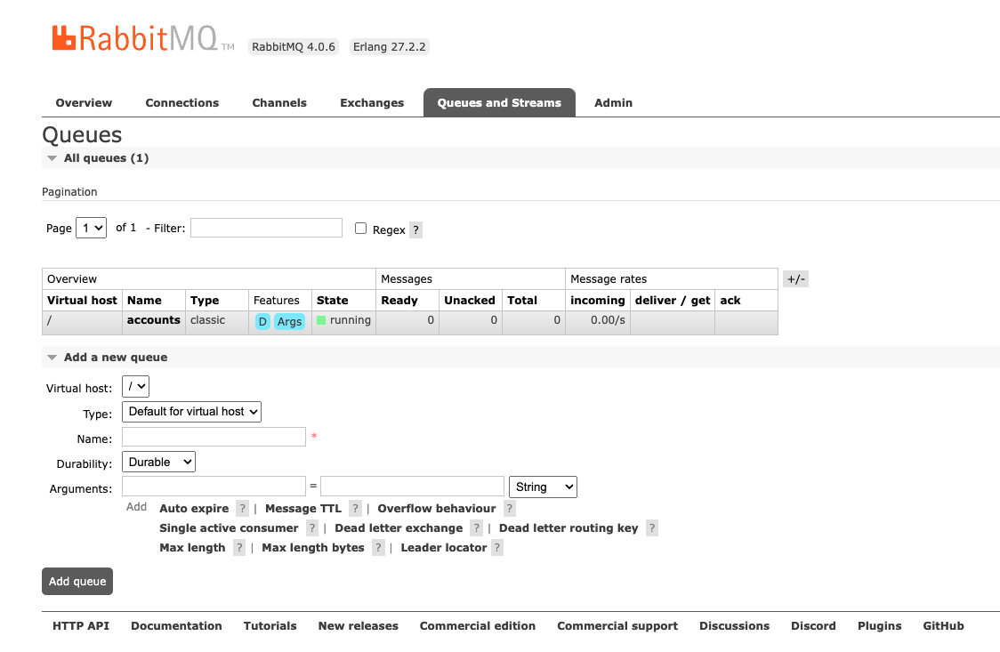

# RabbitMQ

Creating a data generator for RabbitMQ. You will build a Docker image that will be able to populate data in RabbitMQ
for the queues/topics you configure.

## Requirements

- 10 minutes
- Git
- Gradle
- Docker

## Get Started

First, we will clone the data-caterer-example repo which will already have the base project setup required.

=== "Java"

    ```shell
    git clone git@github.com:data-catering/data-caterer-example.git
    ```

=== "Scala"

    ```shell
    git clone git@github.com:data-catering/data-caterer-example.git
    ```

=== "YAML"

    ```shell
    git clone git@github.com:data-catering/data-caterer-example.git
    ```

=== "UI"

    [Run Data Caterer UI via the 'Quick Start' found here.](../../../../get-started/quick-start.md)

If you already have a RabbitMQ instance running, you can skip to [this step](#plan-setup).

### RabbitMQ Setup

Next, let's make sure you have an instance of RabbitMQ up and running in your local environment. This will make it
easy for us to iterate and check our changes.

```shell
cd docker
docker-compose up -d rabbitmq
```

Open up [localhost:15672/#/queues](http://localhost:15672/#/queues) and login with `guest:guest`. Create a new queue 
with name `accounts`.



### Plan Setup

Create a file depending on which interface you want to use.

- Java: `src/main/java/io/github/datacatering/plan/MyAdvancedRabbitMQJavaPlan.java`
- Scala: `src/main/scala/io/github/datacatering/plan/MyAdvancedRabbitMQPlan.scala`
- YAML: `docker/data/custom/plan/my-rabbitmq.yaml`

=== "Java"

    ```java
    import io.github.datacatering.datacaterer.java.api.PlanRun;
    
    public class MyAdvancedRabbitMQJavaPlan extends PlanRun {
    }
    ```

=== "Scala"

    ```scala
    import io.github.datacatering.datacaterer.api.PlanRun
    
    class MyAdvancedRabbitMQPlan extends PlanRun {
    }
    ```

=== "YAML"

    In `docker/data/custom/plan/my-rabbitmq.yaml`:
    ```yaml
    name: "my_rabbitmq_plan"
    description: "Create account data in RabbitMQ"
    tasks:
      - name: "rabbitmq_task"
        dataSourceName: "my_rabbitmq"
    ```

=== "UI"

    1. Click on `Connection` towards the top of the screen
    1. For connection name, set to `my_rabbitmq`
    1. Click on `Select data source type..` and select `RabbitMQ`
    1. Set `URL` as `ampq://host.docker.internal:5672`
        1. Optionally, we could set the JNDI destination (queue or topic) but we would have to create a new connection for each queue or topic
    1. Click on `Create`
    1. You should see your connection `my_rabbitmq` show under `Existing connections`
    1. Click on `Home` towards the top of the screen
    1. Set plan name to `my_rabbitmq_plan`
    1. Set task name to `rabbitmq_task`
    1. Click on `Select data source..` and select `my_rabbitmq`

This class defines where we need to define all of our configurations for generating data. There are helper variables and
methods defined to make it simple and easy to use.

#### Connection Configuration

Within our class, we can start by defining the connection properties to connect to RabbitMQ.

=== "Java"

    ```java
    var accountTask = rabbitmq(
        "my_rabbitmq",                        //name
        "ampq://host.docker.internal:5672", //url
        Map.of()                            //optional additional connection options
    );
    ```
    
    Additional connection options can be found [**here**](../../../connection.md#jms).

=== "Scala"

    ```scala
    val accountTask = rabbitmq(
        "my_rabbitmq",                        //name
        "ampq://host.docker.internal:5672", //url
        Map()                               //optional additional connection options
    )
    ```
    
    Additional connection options can be found [**here**](../../../connection.md#jms).

=== "YAML"

    In `docker/data/custom/application.conf`:
    ```
    jms {
        rabbitmq {
            initialContextFactory = "com.rabbitmqsystems.jndi.SolJNDIInitialContextFactory"
            initialContextFactory = ${?SOLACE_INITIAL_CONTEXT_FACTORY}
            connectionFactory = "/jms/cf/default"
            connectionFactory = ${?SOLACE_CONNECTION_FACTORY}
            url = "smf://rabbitmqserver:55555"
            url = ${?SOLACE_URL}
            user = "admin"
            user = ${?SOLACE_USER}
            password = "admin"
            password = ${?SOLACE_PASSWORD}
            vpnName = "default"
            vpnName = ${?SOLACE_VPN}
        }
    }
    ```

=== "UI"

    1. We have already created the connection details in [this step](#plan-setup)

#### Schema

Let's create a task for inserting data into the `rest_test_queue` or `rest_test_topic` that is already created for us
from this [step](#rabbitmq-setup).

Trimming the connection details to work with the docker-compose RabbitMQ, we have a base RabbitMQ connection to define
the JNDI destination we will publish to. Let's define each field along with their corresponding data type. You will
notice
that the `text` fields do not have a data type defined. This is because the default data type is `StringType`.

=== "Java"

    ```java
    {
        var rabbitmqTask = rabbitmq("my_rabbitmq", "ampq://host.docker.internal:5672")
                .destination("accounts")
                .fields(
                        //field().name("partition").type(IntegerType.instance()),   can define JMS priority here
                        field().messageHeaders(   //set message properties via headers field
                                field().messageHeader("account-id", "body.account_id"),
                                field().messageHeader("updated", "body.details.updated_by-time")
                        )
                ).fields(
                        field().messageBody(
                                field().name("account_id").regex("ACC[0-9]{8}"),
                                field().name("year").type(IntegerType.instance()).min(2021).max(2023),
                                field().name("amount").type(DoubleType.instance()),
                                field().name("details")
                                        .fields(
                                                field().name("name").expression("#{Name.name}"),
                                                field().name("first_txn_date").type(DateType.instance()).sql("ELEMENT_AT(SORT_ARRAY(body.transactions.txn_date), 1)"),
                                                field().name("updated_by")
                                                        .fields(
                                                                field().name("user"),
                                                                field().name("time").type(TimestampType.instance())
                                                        )
                                        ),
                                field().name("transactions").type(ArrayType.instance())
                                        .fields(
                                                field().name("txn_date").type(DateType.instance()).min(Date.valueOf("2021-01-01")).max("2021-12-31"),
                                                field().name("amount").type(DoubleType.instance())
                                        )
                        )
                )
                .count(count().records(10));
    }
    ```

=== "Scala"

    ```scala
    val rabbitmqTask = rabbitmq("my_rabbitmq", "ampq://host.docker.internal:5672")
      .destination("accounts")
      .fields(
        //field.name("partition").type(IntegerType),  can define JMS priority here
        field.messageHeaders(                         //set message properties via headers field
          field.messageHeader("account-id", "body.account_id"),
          field.messageHeader("updated", "body.details.updated_by.time"),
        )
      )
      .fields(
        field.messageBody(
          field.name("account_id").regex("ACC[0-9]{8}"),
          field.name("year").`type`(IntegerType).min(2021).max(2023),
          field.name("account_status").oneOf("open", "closed", "suspended", "pending"),
          field.name("amount").`type`(DoubleType),
          field.name("details").`type`(StructType)
            .fields(
              field.name("name").expression("#{Name.name}"),
              field.name("first_txn_date").`type`(DateType).sql("ELEMENT_AT(SORT_ARRAY(body.transactions.txn_date), 1)"),
              field.name("updated_by").`type`(StructType)
                .fields(
                  field.name("user"),
                  field.name("time").`type`(TimestampType),
                ),
            ),
          field.name("transactions").`type`(ArrayType)
            .fields(
              field.name("txn_date").`type`(DateType).min(Date.valueOf("2021-01-01")).max("2021-12-31"),
              field.name("amount").`type`(DoubleType),
            )
        )
      )
      .count(count.records(10))
    ```

=== "YAML"

    In `docker/data/custom/task/rabbitmq/rabbitmq-task.yaml`:
    ```yaml
    name: "rabbitmq_task"
    steps:
      - name: "rabbitmq_account"
        options:
          destinationName: "accounts"
        fields:
          - name: "messageBody"
            fields:
              - name: "account_id"
              - name: "year"
                type: "int"
                options:
                  min: "2021"
                  max: "2022"
              - name: "amount"
                type: "double"
                options:
                  min: "10.0"
                  max: "100.0"
              - name: "details"
                fields:
                  - name: "name"
                  - name: "first_txn_date"
                    type: "date"
                    options:
                      sql: "ELEMENT_AT(SORT_ARRAY(body.transactions.txn_date), 1)"
                  - name: "updated_by"
                    fields:
                      - name: "user"
                      - name: "time"
                        type: "timestamp"
              - name: "transactions"
                type: "array"
                fields:
                  - name: "txn_date"
                    type: "date"
                  - name: "amount"
                    type: "double"
          - name: "messageHeaders"
            fields:
              - name: "account-id"
                options:
                  sql: "body.account_id"
              - name: "updated"
                options:
                  sql: "body.details.update_by.time"
    ```

=== "UI"

    1. Click on `Generation` and tick the `Manual` checkbox
    1. Click on `+ Field`
        1. Add name as `key`
        1. Click on `Select data type` and select `string`
        1. Click `+` next to data type and select `Sql`. Then enter `body.account_id`
        1. Click on `+ Field` and add name as `messageBody`
        1. Click on `Select data type` and select `struct`
        1. Click on `+ Field` under `messageBody` and add name as `account_id`
        1. Add additional fields under `messageBody` with your own metadata
        1. Click on `+ Field` and add name as `messageHeaders`
        1. Click on `Select data type` and select `struct`
        1. Click on `+ Field` under `messageHeaders` and add name as `account_id`
        1. Add additional fields under `messageHeaders` with your own metadata

#### Fields

The schema defined for RabbitMQ has a format that needs to be followed as noted above. Specifically, the required fields
are:
- `messageBody`

Whilst, the other fields are optional:

- `partition` - refers to JMS priority of the message
- `messageHeaders` - refers to JMS message properties

##### Message Headers

If your messages contain headers, you can follow the details below on generating header values. These can be based off
values contained within you message body or could be static values, just like any other generated field. The main
restriction imposed here is that the `key` of the message header is static and the `value` has to be a valid SQL 
expression.

=== "Java"

    ```java
    field().messageHeaders(
            field().messageHeader("account-id", "body.account_id"),
            field().messageHeader("updated", "body.details.updated_by-time")
    )
    ```

=== "Scala"

    ```scala
    field.messageHeaders(
      field.messageHeader("account-id", "body.account_id"),
      field.messageHeader("updated", "body.details.updated_by.time"),
    )
    ```

=== "YAML"

    In `docker/data/custom/task/rabbitmq/rabbitmq-task.yaml`:
    ```yaml
    name: "rabbitmq_task"
    steps:
      - name: "rabbitmq_account"
        options:
          destinationName: "accounts"
        fields:
          - name: "messageHeaders"
            fields:
              - name: "account-id"
                options:
                  sql: "body.account_id"
              - name: "updated"
                options:
                  sql: "body.details.update_by.time"
    ```

=== "UI"

    1. Click on `+ Field` and add name as `messageHeaders`
    1. Click on `Select data type` and select `struct`
    1. Click on `+ Field` under `messageHeaders` and add name as `account_id`
    1. Add additional fields under `messageHeaders` with your own metadata

##### transactions

`transactions` is an array that contains an inner structure of `txn_date` and `amount`. The size of the array generated
can be controlled via `arrayMinLength` and `arrayMaxLength`.

=== "Java"

    ```java
    field().name("transactions").type(ArrayType.instance())
            .fields(
                    field().name("txn_date").type(DateType.instance()).min(Date.valueOf("2021-01-01")).max("2021-12-31"),
                    field().name("amount").type(DoubleType.instance())
            )
    ```

=== "Scala"

    ```scala
    field.name("transactions").`type`(ArrayType)
      .fields(
        field.name("txn_date").`type`(DateType).min(Date.valueOf("2021-01-01")).max("2021-12-31"),
        field.name("amount").`type`(DoubleType),
      )
    ```

=== "YAML"

    In `docker/data/custom/task/rabbitmq/rabbitmq-task.yaml`:
    ```yaml
    name: "rabbitmq_task"
    steps:
      - name: "rabbitmq_account"
        options:
          destinationName: "accounts"
        fields:
          - name: "messageBody"
            fields:
              - name: "transactions"
                type: "array"
                fields:
                  - name: "txn_date"
                    type: "date"
                  - name: "amount"
                    type: "double"
    ```

=== "UI"

    !!! warning "Warning"
        Inner field definition for array type is currently not supported from the UI. Will be added in the near future!

##### details

`details` is another example of a nested schema structure where it also has a nested structure itself in `updated_by`.
One thing to note here is the `first_txn_date` field has a reference to the `content.transactions` array where it will
sort the array by `txn_date` and get the first element.

=== "Java"

    ```java
    field().name("details")
            .fields(
                    field().name("name").expression("#{Name.name}"),
                    field().name("first_txn_date").type(DateType.instance()).sql("ELEMENT_AT(SORT_ARRAY(content.transactions.txn_date), 1)"),
                    field().name("updated_by")
                            .fields(
                                    field().name("user"),
                                    field().name("time").type(TimestampType.instance())
                            )
            )
    ```

=== "Scala"

    ```scala
    field.name("details")
      .fields(
        field.name("name").expression("#{Name.name}"),
        field.name("first_txn_date").`type`(DateType).sql("ELEMENT_AT(SORT_ARRAY(content.transactions.txn_date), 1)"),
        field.name("updated_by")
          .fields(
            field.name("user"),
            field.name("time").`type`(TimestampType),
          ),
      )
    ```

=== "YAML"

    In `docker/data/custom/task/rabbitmq/rabbitmq-task.yaml`:
    ```yaml
    name: "rabbitmq_task"
    steps:
      - name: "rabbitmq_account"
        options:
          destinationName: "accounts"
        fields:
          - name: "messageBody"
            fields:
              - name: "details"
                fields:
                  - name: "name"
                  - name: "first_txn_date"
                    type: "date"
                    options:
                      sql: "ELEMENT_AT(SORT_ARRAY(body.transactions.txn_date), 1)"
                  - name: "updated_by"
                    fields:
                      - name: "user"
                      - name: "time"
                        type: "timestamp"
    ```

=== "UI"

    1. Click on `+ Field` and add name as `messageBody`
    1. Click on `Select data type` and select `struct`
    1. Click on `+ Field` under `messageBody` and add name as `details`
    1. Add additional fields under `details` with your own metadata

#### Additional Configurations

At the end of data generation, a report gets generated that summarises the actions it performed. We can control the
output folder of that report via configurations.

=== "Java"

    ```java
    var config = configuration()
            .generatedReportsFolderPath("/opt/app/data/report");
    ```

=== "Scala"

    ```scala
    val config = configuration
      .generatedReportsFolderPath("/opt/app/data/report")
    ```

=== "YAML"

    In `docker/data/custom/application.conf`:
    ```
    folders {
      generatedReportsFolderPath = "/opt/app/data/report"
    }
    ```

=== "UI"

    1. Click on `Advanced Configuration` towards the bottom of the screen
    1. Click on `Folder` and enter `/tmp/data-caterer/report` for `Generated Reports Folder Path`

#### Execute

To tell Data Caterer that we want to run with the configurations along with the `rabbitmqTask`, we have to call `execute`.

### Run

Now we can run via the script `./run.sh` that is in the top level directory of the `data-caterer-example` to run the
class we just created.

=== "Java"

    ```shell
    ./run.sh AdvancedRabbitMQJavaPlanRun
    #after completing, check http://localhost:15672/#/queues/%2F/accounts from browser
    ```

=== "Scala"

    ```shell
    ./run.sh AdvancedRabbitMQPlanRun
    #after completing, check http://localhost:15672/#/queues/%2F/accounts from browser
    ```

=== "YAML"

    ```shell
    ./run.sh my-rabbitmq.yaml
    #after completing, check http://localhost:15672/#/queues/%2F/accounts from browser
    ```

=== "UI"

    1. Click the button `Execute` at the top
    1. Progress updates will show in the bottom right corner
    1. Click on `History` at the top
    1. Check for your plan name and see the result summary
    1. Click on `Report` on the right side to see more details of what was executed

Your output should look like this.


You can check the message payload by clicking on `Get Message(s)`. Once you copy the payload, you can run a command 
like: `echo "<payload>" | base64 -D` to see the actual message.


Also check the HTML report, found at `docker/sample/report/index.html`, that gets generated to get an overview of what
was executed. Or view the sample report found [here](../../../../sample/report/html/index.html).
