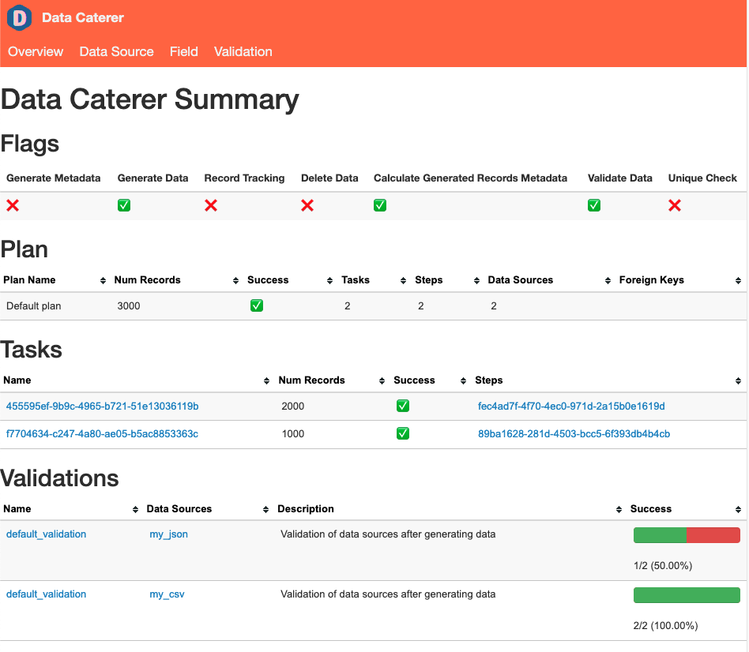

# Data Generation

Go through the available options for data generation. Creating a data generator for a CSV file.


## Requirements

- 5 minutes
- Git
- Gradle
- Docker

## Get Started

First, we will clone the data-caterer-example repo which will already have the base project setup required.

=== "Java"

    ```shell
    git clone git@github.com:data-catering/data-caterer-example.git
    ```

=== "Scala"

    ```shell
    git clone git@github.com:data-catering/data-caterer-example.git
    ```

=== "YAML"

    ```shell
    git clone git@github.com:data-catering/data-caterer-example.git
    ```

=== "UI"

    [Run Data Caterer UI via the 'Quick Start' found here.](../../../get-started/quick-start.md)

### Plan Setup

Create a new Java or Scala class or plan YAML.

- Java: `src/main/java/io/github/datacatering/plan/MyCsvPlan.java`
- Scala: `src/main/scala/io/github/datacatering/plan/MyCsvPlan.scala`
- YAML: `docker/data/customer/plan/my-csv.yaml`

Make sure your class extends `PlanRun`.

=== "Java"

    ```java
    import io.github.datacatering.datacaterer.java.api.PlanRun;
    
    public class MyCsvJavaPlan extends PlanRun {
    }
    ```

=== "Scala"

    ```scala
    import io.github.datacatering.datacaterer.api.PlanRun
    
    class MyCsvPlan extends PlanRun {
    }
    ```

=== "YAML"

    In `docker/data/custom/plan/my-csv.yaml`:
    ```yaml
    name: "my_csv_plan"
    description: "Create account data in CSV file"
    tasks:
      - name: "csv_account_file"
        dataSourceName: "customer_accounts"
    ```

=== "UI"

    Go to next section.

This class defines where we need to define all of our configurations for generating data. There are helper variables and
methods defined to make it simple and easy to use.

#### Connection Configuration

When dealing with CSV files, we need to define a path for our generated CSV files to be saved at, along with any other
high level configurations.

=== "Java"

    ```java
    csv(
      "customer_accounts",              //name
      "/opt/app/data/customer/account", //path
      Map.of("header", "true")          //optional additional options
    )
    ```
    
    [Other additional options for CSV can be found here](https://spark.apache.org/docs/latest/sql-data-sources-csv.html#data-source-option)

=== "Scala"

    ```scala
    csv(
      "customer_accounts",              //name
      "/opt/app/data/customer/account", //path
      Map("header" -> "true")           //optional additional options
    )
    ```

    [Other additional options for CSV can be found here](https://spark.apache.org/docs/latest/sql-data-sources-csv.html#data-source-option)

=== "YAML"

    In `docker/data/custom/application.conf`:
    ```
    csv {
      customer_accounts {
        path = "/opt/app/data/customer/account"
        path = ${?CSV_PATH}
        header = "true"
      }
    }
    ```

=== "UI"

    1. Go to `Connection` tab in the top bar
    2. Select data source as `CSV`
        1. Enter in data source name `customer_accounts`
        3. Enter path as `/tmp/data-caterer/customer/account`

#### Schema

Our CSV file that we generate should adhere to a defined schema where we can also define data types.

Let's define each field along with their corresponding data type. You will notice that the `string` fields do not have a
data type defined. This is because the default data type is `StringType`.

=== "Java"

    ```java
    var accountTask = csv("customer_accounts", "/opt/app/data/customer/account", Map.of("header", "true"))
            .fields(
                    field().name("account_id"),
                    field().name("balance").type(DoubleType.instance()),
                    field().name("created_by"),
                    field().name("name"),
                    field().name("open_time").type(TimestampType.instance()),
                    field().name("status")
            );
    ```

=== "Scala"

    ```scala
    val accountTask = csv("customer_accounts", "/opt/app/data/customer/account", Map("header" -> "true"))
      .fields(
        field.name("account_id"),
        field.name("balance").`type`(DoubleType),
        field.name("created_by"),
        field.name("name"),
        field.name("open_time").`type`(TimestampType),
        field.name("status")
      )
    ```

=== "YAML"

    In `docker/data/custom/task/file/csv/csv-account-task.yaml`:
    ```yaml
    name: "csv_account_file"
    steps:
      - name: "accounts"
        type: "csv"
        options:
          path: "/opt/app/custom/csv/transactions"
        fields:
          - name: "account_id"
          - name: "balance"
            type: "double"
          - name: "created_by"
          - name: "name"
          - name: "open_time"
            type: "timestamp"
          - name: "status"
    ```

=== "UI"

    1. Go to `Home` tab in the top bar
    2. Enter `my-csv` as the `Plan name`
    3. Under `Tasks`, enter `csv-account-task` as `Task name` and select data source as `customer_accounts`
    4. Click on `Generation` and tick the `Manual` checkbox
    5. Click on `+ Field`
        1. Add field `account_id` with type `string`
        1. Add field `balance` with type `double`
        1. Add field `created_by` with type `string`
        1. Add field `name` with type `string`
        1. Add field `open_time` with type `timestamp`
        1. Add field `status` with type `string`


#### Field Metadata

We could stop here and generate random data for the accounts table. But wouldn't it be more useful if we produced data
that is closer to the structure of the data that would come in production? We can do this by defining various metadata
attributes that add guidelines that the data generator will understand when generating data.

##### account_id

- `account_id` follows a particular pattern that where it starts with `ACC` and has 8 digits after it.
  This can be defined via a regex like below. Alongside, we also mention that values are unique ensure that
  unique values are generated.

=== "Java"

    ```java
    field().name("account_id").regex("ACC[0-9]{8}").unique(true),
    ```

=== "Scala"

    ```scala
    field.name("account_id").regex("ACC[0-9]{8}").unique(true),
    ```

=== "YAML"

    ```yaml
    fields:
      - name: "account_id"
        options:
          regex: "ACC[0-9]{8}"
          unique: true
    ```

=== "UI"

    1. Go to `account_id` field
    2. Click on `+` dropdown next to `string` data type
    3. Click `Regex` and enter `ACC[0-9]{8}`
    4. Click `Unique` and select `true`

##### balance

- `balance` let's make the numbers not too large, so we can define a min and max for the generated numbers to be between
  `1` and `1000`.

=== "Java"

    ```java
    field().name("balance").type(DoubleType.instance()).min(1).max(1000),
    ```

=== "Scala"

    ```scala
    field.name("balance").`type`(DoubleType).min(1).max(1000),
    ```

=== "YAML"

    ```yaml
    fields:
      - name: "balance"
        type: "double"
        options:
          min: 1
          max: 1000
    ```

=== "UI"

    1. Go to `balance` field
    2. Click on `+` dropdown next to `double` data type
    3. Click `Min` and enter `1`
    4. Click `Max` and enter `1000`

##### name

- `name` is a string that also follows a certain pattern, so we could also define a regex but here we will choose to
  leverage the DataFaker library and create an `expression` to generate real looking name. All possible faker
  expressions
  can be found [**here**](../../../sample/datafaker/expressions.txt)

=== "Java"

    ```java
    field().name("name").expression("#{Name.name}"),
    ```

=== "Scala"

    ```scala
    field.name("name").expression("#{Name.name}"),
    ```

=== "YAML"

    ```yaml
    fields:
      - name: "name"
        options:
          expression: "#{Name.name}"
    ```

=== "UI"

    1. Go to `name` field
    2. Click on `+` dropdown next to `string` data type
    3. Click `Faker Expression` and enter `#{Name.name}`

##### open_time

- `open_time` is a timestamp that we want to have a value greater than a specific date. We can define a min date by
  using
  `java.sql.Date` like below.

=== "Java"

    ```java
    field().name("open_time").type(TimestampType.instance()).min(java.sql.Date.valueOf("2022-01-01")),
    ```

=== "Scala"

    ```scala
    field.name("open_time").`type`(TimestampType).min(java.sql.Date.valueOf("2022-01-01")),
    ```

=== "YAML"

    ```yaml
    fields:
      - name: "open_time"
        type: "timestamp"
        options:
          min: "2022-01-01"
    ```

=== "UI"

    1. Go to `open_time` field
    2. Click on `+` dropdown next to `timestamp` data type
    3. Click `Min` and enter `2022-01-01`

##### status

- `status` is a field that can only obtain one of four values, `open, closed, suspended or pending`.

=== "Java"

    ```java
    field().name("status").oneOf("open", "closed", "suspended", "pending")
    ```

=== "Scala"

    ```scala
    field.name("status").oneOf("open", "closed", "suspended", "pending")
    ```

=== "YAML"

    ```yaml
    fields:
      - name: "status"
        options:
          oneOf:
            - "open"
            - "closed"
            - "suspended"
            - "pending"
    ```

=== "UI"

    1. Go to `status` field
    2. Click on `+` dropdown next to `string` data type
    3. Click `One Of` and enter `open,closed,suspended,pending`

##### created_by

- `created_by` is a field that is based on the `status` field where it follows the
  logic: `if status is open or closed, then
  it is created_by eod else created_by event`. This can be achieved by defining a SQL expression like below.

=== "Java"

    ```java
    field().name("created_by").sql("CASE WHEN status IN ('open', 'closed') THEN 'eod' ELSE 'event' END"),
    ```

=== "Scala"

    ```scala
    field.name("created_by").sql("CASE WHEN status IN ('open', 'closed') THEN 'eod' ELSE 'event' END"),
    ```

=== "YAML"

    ```yaml
    fields:
      - name: "created_by"
        options:
          sql: "CASE WHEN status IN ('open', 'closed') THEN 'eod' ELSE 'event' END"
    ```

=== "UI"

    1. Go to `created_by` field
    2. Click on `+` dropdown next to `string` data type
    3. Click `SQL` and enter `CASE WHEN status IN ('open', 'closed') THEN 'eod' ELSE 'event' END`

Putting it all the fields together, our structure should now look like this.

=== "Java"

    ```java
    var accountTask = csv("customer_accounts", "/opt/app/data/customer/account", Map.of("header", "true"))
            .fields(
                    field().name("account_id").regex("ACC[0-9]{8}").unique(true),
                    field().name("balance").type(DoubleType.instance()).min(1).max(1000),
                    field().name("created_by").sql("CASE WHEN status IN ('open', 'closed') THEN 'eod' ELSE 'event' END"),
                    field().name("name").expression("#{Name.name}"),
                    field().name("open_time").type(TimestampType.instance()).min(java.sql.Date.valueOf("2022-01-01")),
                    field().name("status").oneOf("open", "closed", "suspended", "pending")
            );
    ```

=== "Scala"

    ```scala
    val accountTask = csv("customer_accounts", "/opt/app/data/customer/account", Map("header" -> "true"))
      .fields(
        field.name("account_id").regex("ACC[0-9]{8}").unique(true),
        field.name("balance").`type`(DoubleType).min(1).max(1000),
        field.name("created_by").sql("CASE WHEN status IN ('open', 'closed') THEN 'eod' ELSE 'event' END"),
        field.name("name").expression("#{Name.name}"),
        field.name("open_time").`type`(TimestampType).min(java.sql.Date.valueOf("2022-01-01")),
        field.name("status").oneOf("open", "closed", "suspended", "pending")
      )
    ```

=== "YAML"

    In `docker/data/custom/task/file/csv/csv-account-task.yaml`:
    ```yaml
    name: "csv_account_file"
    steps:
      - name: "accounts"
        type: "csv"
        options:
          path: "/opt/app/custom/csv/account"
        count:
          records: 100
        fields:
          - name: "account_id"
            options:
              regex: "ACC1[0-9]{9}"
              unique: true
          - name: "balance"
            type: "double"
            options:
              min: 1
              max: 1000
          - name: "created_by"
            options:
              sql: "CASE WHEN status IN ('open', 'closed') THEN 'eod' ELSE 'event' END"
          - name: "name"
            options:
              expression: "#{Name.name}"
          - name: "open_time"
            type: "timestamp"
            options:
              min: "2022-01-01"
          - name: "status"
            options:
              oneOf:
                - "open"
                - "closed"
                - "suspended"
                - "pending"
    ```

=== "UI"

    Open `Task` and `Generation` to see all the fields.

#### Record Count

We only want to generate 100 records, so that we can see what the output looks like. This is controlled at the
`accountTask` level like below. If you want to generate more records, set it to the value you want.

=== "Java"

    ```java
    var accountTask = csv("customer_accounts", "/opt/app/data/customer/account", Map.of("header", "true"))
            .fields(
                    ...
            )
            .count(count().records(100));
    ```

=== "Scala"

    ```scala
    val accountTask = csv("customer_accounts", "/opt/app/data/customer/account", Map("header" -> "true"))
      .fields(
        ...
      )
      .count(count.records(100))
    ```

=== "YAML"

    In `docker/data/custom/task/file/csv/csv-account-task.yaml`:
    ```yaml
    name: "csv_account_file"
    steps:
      - name: "accounts"
        type: "csv"
        options:
          path: "/opt/app/custom/csv/transactions"
        count:
          records: 100
        fields:
          ...
    ```

=== "UI"

    1. Under task `customer_accounts`, click on `Generation`
    2. Under title `Record Count`, set `Records` to `100`

#### Additional Configurations

At the end of data generation, a report gets generated that summarises the actions it performed. We can control the
output folder of that report via configurations. We will also enable the unique check to ensure any unique fields will
have unique values generated.

=== "Java"

    ```java
    var config = configuration()
            .generatedReportsFolderPath("/opt/app/data/report")
            .enableUniqueCheck(true);
    ```

=== "Scala"

    ```scala
    val config = configuration
      .generatedReportsFolderPath("/opt/app/data/report")
      .enableUniqueCheck(true)
    ```

=== "YAML"

    In `docker/data/custom/application.conf`:
    ```
    flags {
      enableUniqueCheck = true
    }
    folders {
      generatedReportsFolderPath = "/opt/app/data/report"
    }
    ```

=== "UI"

    1. Click on `Advanced Configuration` towards the bottom of the screen
    2. Click on `Flag` and click on `Unique Check`
    3. Click on `Folder` and enter `/tmp/data-caterer/report` for `Generated Reports Folder Path`

#### Execute

To tell Data Caterer that we want to run with the configurations along with the `accountTask`, we have to call `execute`
. So our full plan run will look like this.

=== "Java"

    ```java
    public class MyCsvJavaPlan extends PlanRun {
        {
            var accountTask = csv("customer_accounts", "/opt/app/data/customer/account", Map.of("header", "true"))
                    .fields(
                            field().name("account_id").regex("ACC[0-9]{8}").unique(true),
                            field().name("balance").type(DoubleType.instance()).min(1).max(1000),
                            field().name("created_by").sql("CASE WHEN status IN ('open', 'closed') THEN 'eod' ELSE 'event' END"),
                            field().name("name").expression("#{Name.name}"),
                            field().name("open_time").type(TimestampType.instance()).min(java.sql.Date.valueOf("2022-01-01")),
                            field().name("status").oneOf("open", "closed", "suspended", "pending")
                    );
            
            var config = configuration()
                    .generatedReportsFolderPath("/opt/app/data/report")
                    .enableUniqueCheck(true);
    
            execute(config, accountTask);
        }
    }
    ```

=== "Scala"

    ```scala
    class MyCsvPlan extends PlanRun {

      val accountTask = csv("customer_accounts", "/opt/app/data/customer/account", Map("header" -> "true"))
        .fields(
          field.name("account_id").regex("ACC[0-9]{8}").unique(true),
          field.name("balance").`type`(DoubleType).min(1).max(1000),
          field.name("created_by").sql("CASE WHEN status IN ('open', 'closed') THEN 'eod' ELSE 'event' END"),
          field.name("name").expression("#{Name.name}"),
          field.name("open_time").`type`(TimestampType).min(java.sql.Date.valueOf("2022-01-01")),
          field.name("status").oneOf("open", "closed", "suspended", "pending")
        )
        val config = configuration
          .generatedReportsFolderPath("/opt/app/data/report")
          .enableUniqueCheck(true)
        
        execute(config, accountTask)
    }
    ```

=== "YAML"
  
    Plan and task file should be ready.

=== "UI"

    1. Click `Save` at the top

### Run

Now we can run via the script `./run.sh` that is in the top level directory of the `data-caterer-example` to run the
class we just created.

=== "Java"

    ```shell
    ./run.sh MyCsvJavaPlan
    head docker/sample/customer/account/part-00000*
    ```

=== "Scala"

    ```shell
    ./run.sh MyCsvPlan
    head docker/sample/customer/account/part-00000*
    ```

=== "YAML"

    ```shell
    ./run.sh my-csv.yaml
    head docker/sample/customer/account/part-00000*
    ```

=== "UI"

    1. Click on `Execute` at the top
    ```shell
    head /tmp/data-caterer/customer/account/part-00000*
    ```

Your output should look like this.

```shell
account_id,balance,created_by,name,open_time,status
ACC06192462,853.9843359645766,eod,Hoyt Kertzmann MD,2023-07-22T11:17:01.713Z,closed
ACC15350419,632.5969895326234,eod,Dr. Claude White,2022-12-13T21:57:56.840Z,open
ACC25134369,592.0958847218986,eod,Fabian Rolfson,2023-04-26T04:54:41.068Z,open
ACC48021786,656.6413439322964,eod,Dewayne Stroman,2023-05-17T06:31:27.603Z,open
ACC26705211,447.2850352884595,event,Garrett Funk,2023-07-14T03:50:22.746Z,pending
ACC03150585,750.4568929015996,event,Natisha Reichel,2023-04-11T11:13:10.080Z,suspended
ACC29834210,686.4257811608622,event,Gisele Ondricka,2022-11-15T22:09:41.172Z,suspended
ACC39373863,583.5110618128994,event,Thaddeus Ortiz,2022-09-30T06:33:57.193Z,suspended
ACC39405798,989.2623959059525,eod,Shelby Reinger,2022-10-23T17:29:17.564Z,open
```

Also check the HTML report, found at `docker/sample/report/index.html`, that gets generated to get an overview of what
was executed.



### Join With Another CSV

Now that we have generated some accounts, let's also try to generate a set of transactions for those accounts in CSV
format as well. The transactions could be in any other format, but to keep this simple, we will continue using CSV.

We can define our schema the same way along with any additional metadata.

=== "Java"

    ```java
    var transactionTask = csv("customer_transactions", "/opt/app/data/customer/transaction", Map.of("header", "true"))
            .fields(
                    field().name("account_id"),
                    field().name("name"),
                    field().name("amount").type(DoubleType.instance()).min(1).max(100),
                    field().name("time").type(TimestampType.instance()).min(java.sql.Date.valueOf("2022-01-01")),
                    field().name("date").type(DateType.instance()).sql("DATE(time)")
            );
    ```

=== "Scala"

    ```scala
    val transactionTask = csv("customer_transactions", "/opt/app/data/customer/transaction", Map("header" -> "true"))
      .fields(
        field.name("account_id"),
        field.name("full_name"),
        field.name("amount").`type`(DoubleType).min(1).max(100),
        field.name("time").`type`(TimestampType).min(java.sql.Date.valueOf("2022-01-01")),
        field.name("date").`type`(DateType).sql("DATE(time)")
      )
    ```


=== "YAML"

    In `docker/data/custom/task/file/csv/csv-account-task.yaml`:
    ```yaml
    name: "csv_account_file"
    steps:
      - name: "accounts"
        type: "csv"
        options:
          path: "/opt/app/custom/csv/account"
        ...
      - name: "transactions"
        type: "csv"
        options:
          path: "/opt/app/custom/csv/transactions"
        fields:
          - name: "account_id"
          - name: "full_name"
          - name: "amount"
            type: "double"
            options:
              min: 1
              max: 100
          - name: "time"
            type: "timestamp"
            options:
              min: "2022-01-01"
          - name: "date"
            type: "date"
            options:
              sql: "DATE(time)"
    ```

=== "UI"

    1. Go to `Connection` tab and add new `CSV` data source with path `/tmp/data-caterer/customer/transactions`
    2. Go to `Plan` tab and click on `Edit` for `my-csv`
    3. Click on `+ Task` towards the top
    4. Under the new task, enter `csv-transaction-task` as `Task name` and select data source as `customer_accounts`
    5. Click on `Generation` and tick the `Manual` checkbox
    6. Click on `+ Field`
        1. Add field `account_id` with type `string`
        1. Add field `balance` with type `double`
        1. Add field `created_by` with type `string`
        1. Add field `name` with type `string`
        1. Add field `open_time` with type `timestamp`
        1. Add field `status` with type `string`

#### Records Per Field

Usually, for a given `account_id, full_name`, there should be multiple records for it as we want to simulate a customer
having multiple transactions. We can achieve this through defining the number of records to generate in the `count`
function.

=== "Java"

    ```java
    var transactionTask = csv("customer_transactions", "/opt/app/data/customer/transaction", Map.of("header", "true"))
            .fields(...)
            .count(count().recordsPerField(5, "account_id", "full_name"));
    ```

=== "Scala"

    ```scala
    val transactionTask = csv("customer_transactions", "/opt/app/data/customer/transaction", Map("header" -> "true"))
      .fields(...)
      .count(count.recordsPerField(5, "account_id", "full_name"))
    ```

=== "YAML"

    In `docker/data/custom/task/file/csv/csv-account-task.yaml`:
    ```yaml
    name: "csv_account_file"
    steps:
      - name: "accounts"
        ...
      - name: "transactions"
        type: "csv"
        options:
          path: "/opt/app/custom/csv/transactions"
        count:
          records: 100
          perField:
            fieldNames:
              - "account_id"
              - "name"
            count: 5
    ```

=== "UI"

    1. Under title `Record count`, click on `Advanced`
    2. Enter `account_id,name` in `Field(s)`
    3. Click on `Per unique set of values` checkbox
    4. Set `Records` to `5`

##### Random Records Per Field

Above, you will notice that we are generating 5 records per `account_id, full_name`. This is okay but still not quite
reflective of the real world. Sometimes, people have accounts with no transactions in them, or they could have many. We
can accommodate for this via defining a random number of records per field.

=== "Java"

    ```java
    var transactionTask = csv("customer_transactions", "/opt/app/data/customer/transaction", Map.of("header", "true"))
            .fields(
                    ...
            )
            .count(count().recordsPerFieldGenerator(generator().min(0).max(5), "account_id", "full_name"));
    ```

=== "Scala"

    ```scala
    val transactionTask = csv("customer_transactions", "/opt/app/data/customer/transaction", Map("header" -> "true"))
      .fields(
        ...
      )
      .count(count.recordsPerFieldGenerator(generator.min(0).max(5), "account_id", "full_name"))
    ```

=== "YAML"

    In `docker/data/custom/task/file/csv/csv-account-task.yaml`:
    ```yaml
    name: "csv_account_file"
    steps:
      - name: "accounts"
        ...
      - name: "transactions"
        type: "csv"
        options:
          path: "/opt/app/custom/csv/transactions"
        count:
          records: 100
          perField:
            fieldNames:
              - "account_id"
              - "name"
            options:
              min: 0
              max: 5
    ```

=== "UI"

    1. Under title `Record count`, click on `Advanced`
    2. Enter `account_id,name` in `Field(s)`
    3. Click on `Per unique set of values between` checkbox
    4. Set `Min` to `0` and `Max to `5`

Here we set the minimum number of records per field to be 0 and the maximum to 5.

#### Foreign Key

In this scenario, we want to match the `account_id` in `account` to match the same field values in `transaction`. We
also want to match `name` in `account` to `full_name` in `transaction`. This can be done via plan configuration like
below.

=== "Java"

    ```java
    var myPlan = plan().addForeignKeyRelationship(
            accountTask, List.of("account_id", "name"), //the task and fields we want linked
            List.of(Map.entry(transactionTask, List.of("account_id", "full_name"))) //list of other tasks and their respective field names we want matched
    );
    ```

=== "Scala"

    ```scala
    val myPlan = plan.addForeignKeyRelationship(
      accountTask, List("account_id", "name"),  //the task and fields we want linked
      List(transactionTask -> List("account_id", "full_name"))  //list of other tasks and their respective field names we want matched
    )
    ```

=== "YAML"

    In `docker/data/custom/plan/my-csv.yaml`:
    ```yaml
    name: "my_csv_plan"
    description: "Create account data in CSV file"
    tasks:
      - name: "csv_account_file"
        dataSourceName: "customer_accounts"

    sinkOptions:
      foreignKeys:
        - source:
            dataSource: "customer_accounts"
            step: "accounts"
            fields: ["account_id", "name"]
          generate:
            - dataSource: "customer_accounts"
              step: "transactions"
              fields: ["account_id", "full_name"]
      ```

=== "UI"

    1. Click `Relationships` and then click `+ Relationship`
    2. Select `csv-account-task` and enter `account_id,name` in `Field(s)`
    3. Open `Generation` and click `+ Link`
    4. Select `csv-transaction-task` and enter `account_id,full_name` in `Field(s)`

Now, stitching it all together for the `execute` function, our final plan should look like this.

=== "Java"

    ```java
    public class MyCsvJavaPlan extends PlanRun {
        {
            var accountTask = csv("customer_accounts", "/opt/app/data/customer/account", Map.of("header", "true"))
                    .fields(
                            field().name("account_id").regex("ACC[0-9]{8}").unique(true),
                            field().name("balance").type(DoubleType.instance()).min(1).max(1000),
                            field().name("created_by").sql("CASE WHEN status IN ('open', 'closed') THEN 'eod' ELSE 'event' END"),
                            field().name("name").expression("#{Name.name}"),
                            field().name("open_time").type(TimestampType.instance()).min(java.sql.Date.valueOf("2022-01-01")),
                            field().name("status").oneOf("open", "closed", "suspended", "pending")
                    )
                    .count(count().records(100));
    
            var transactionTask = csv("customer_transactions", "/opt/app/data/customer/transaction", Map.of("header", "true"))
                    .fields(
                            field().name("account_id"),
                            field().name("name"),
                            field().name("amount").type(DoubleType.instance()).min(1).max(100),
                            field().name("time").type(TimestampType.instance()).min(java.sql.Date.valueOf("2022-01-01")),
                            field().name("date").type(DateType.instance()).sql("DATE(time)")
                    )
                    .count(count().recordsPerFieldGenerator(generator().min(0).max(5), "account_id", "full_name"));
    
            var config = configuration()
                    .generatedReportsFolderPath("/opt/app/data/report")
                    .enableUniqueCheck(true);
    
            var myPlan = plan().addForeignKeyRelationship(
                    accountTask, List.of("account_id", "name"),
                    List.of(Map.entry(transactionTask, List.of("account_id", "full_name")))
            );
    
            execute(myPlan, config, accountTask, transactionTask);
        }
    }
    ```

=== "Scala"

    ```scala
    class MyCsvPlan extends PlanRun {
    
      val accountTask = csv("customer_accounts", "/opt/app/data/customer/account", Map("header" -> "true"))
        .fields(
          field.name("account_id").regex("ACC[0-9]{8}").unique(true),
          field.name("balance").`type`(DoubleType).min(1).max(1000),
          field.name("created_by").sql("CASE WHEN status IN ('open', 'closed') THEN 'eod' ELSE 'event' END"),
          field.name("name").expression("#{Name.name}"),
          field.name("open_time").`type`(TimestampType).min(java.sql.Date.valueOf("2022-01-01")),
          field.name("status").oneOf("open", "closed", "suspended", "pending")
        )
        .count(count.records(100))
    
      val transactionTask = csv("customer_transactions", "/opt/app/data/customer/transaction", Map("header" -> "true"))
        .fields(
          field.name("account_id"),
          field.name("name"),
          field.name("amount").`type`(DoubleType).min(1).max(100),
          field.name("time").`type`(TimestampType).min(java.sql.Date.valueOf("2022-01-01")),
          field.name("date").`type`(DateType).sql("DATE(time)")
        )
        .count(count.recordsPerFieldGenerator(generator.min(0).max(5), "account_id", "full_name"))
    
      val config = configuration
        .generatedReportsFolderPath("/opt/app/data/report")
        .enableUniqueCheck(true)
    
      val myPlan = plan.addForeignKeyRelationship(
        accountTask, List("account_id", "name"),
        List(transactionTask -> List("account_id", "full_name"))
      )
    
      execute(myPlan, config, accountTask, transactionTask)
    }
    ```

=== "YAML"

    Check content of `docker/data/custom/plan/my-csv.yaml` and `docker/data/custom/task/file/csv/csv-account-task.yaml`.

=== "UI"

    Open UI dropdowns to see all details.

Let's clean up the old data and try run again.

```shell
#clean up old data
rm -rf docker/sample/customer/account
```

=== "Java"

    ```shell
    ./run.sh MyCsvJavaPlan
    account=$(tail -1 docker/sample/customer/account/part-00000* | awk -F "," '{print $1 "," $4}')
    echo $account
    cat docker/sample/customer/transaction/part-00000* | grep $account
    ```

=== "Scala"

    ```shell
    ./run.sh MyCsvPlan
    account=$(tail -1 docker/sample/customer/account/part-00000* | awk -F "," '{print $1 "," $4}')
    echo $account
    cat docker/sample/customer/transaction/part-00000* | grep $account
    ```

=== "YAML"

    ```shell
    ./run.sh my-csv.yaml
    account=$(tail -1 docker/sample/customer/account/part-00000* | awk -F "," '{print $1 "," $4}')
    echo $account
    cat docker/sample/customer/transaction/part-00000* | grep $account
    ```

=== "UI"

    1. Click on `Execute` at the top
    ```shell
    account=$(tail -1 /tmp/data-caterer/customer/account/part-00000* | awk -F "," '{print $1 "," $4}')
    echo $account
    cat /tmp/data-caterer/customer/transaction/part-00000* | grep $account
    ```

It should look something like this.

```shell
ACC29117767,Willodean Sauer
ACC29117767,Willodean Sauer,84.99145871948083,2023-05-14T09:55:51.439Z,2023-05-14
ACC29117767,Willodean Sauer,58.89345733567232,2022-11-22T07:38:20.143Z,2022-11-22
```

Congratulations! You have now made a data generator that has simulated a real world data scenario. You can check the
`DocumentationJavaPlanRun.java` or `DocumentationPlanRun.scala` files as well to check that your plan is the same.
