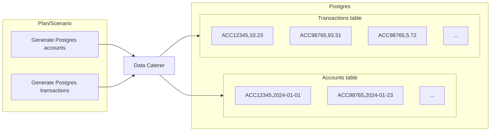
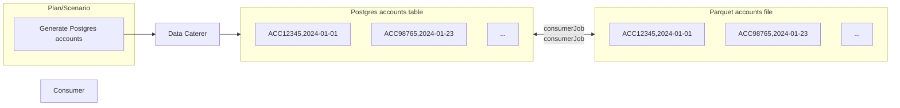

# Delete Generated Data

!!! example "Info"

    Deleting generated data is a paid feature. Try the free trial [here](../get-started/docker.md).

As you generate and validate data, you may want to clean up the data that has been generated. This helps you:

1. Keep your test environments clean
2. Reduce chance of existing data interacting with your validations
3. Creates a simple workflow for developers and testers to follow

## Foreign Keys/Relationships

You can either define a foreign key for data generation (i.e. create same account numbers across accounts and transactions table)
or for data deletion (i.e. account numbers generated in Postgres are consumed by a job and pushed into a Parquet file, you 
can delete the Postgres and Parquet data via the account numbers generated).

### Generate

In scenarios where you have defined foreign keys for multiple data sources, when data is generated, Data Caterer will ensure
that the values generated in one data source, will be the same in the other. When you want to delete the data, data will
be deleted in reverse order of how the data was inserted. This ensures that for data sources, such as Postgres, no errors
will occur whilst deleting data.

### Delete

