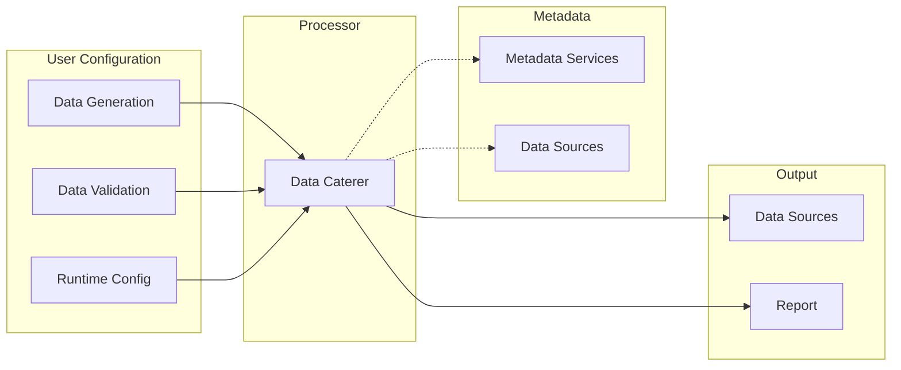

# Design

This document shows the thought process behind the design of Data Caterer to help give you insights as to how and why
it was created to what it is today. Also, this serves as a reference for future design decisions which will get updated 
here and thus is a living document.

## Motivation

The main difficulties that I faced as a developer and team lead relating to testing were:

- Difficulty in testing with multiple data sources, both batch and real time
  - Reliance on other teams for stable environments or domain knowledge
- Test environments with no reliable or consistent data flows
  - Complex data masking/anonymization solutions
  - Relying on production data (potential privacy and data breach issues)
- Cost of data production issues can be very high
- Unknown unknowns staying hidden until problems occur in production
- Underutilised metadata

## Guiding Principles

These difficulties helped formed the basis of the principles for which Data Caterer should follow:

- **Data source agnostic**: Connect to any batch or real time data sources for data generation or validation
- **Configurable**: Run the application the way you want
- **Extensible**: Allow for new innovations to seamlessly integrate with Data Caterer
- **Integrate with existing solutions**: Utilise existing metadata to make it easy for users to use straight away
- **Secure**: No production connections required, metadata based solution
- **Fast**: Give developers fast feedback loops to encourage them to thoroughly test data flows

## High level flow

1. User Configuration
    1. Users define data generation, validation and runtime configuration
2. Processor
    1. Engine will take user configuration to decide how to run
    2. User defined configuration merged with metadata from external sources
3. Metadata
    1. Automatically retrieve schema, data profiling, relationship or validation rule metadata from data sources or metadata services
4. Output
    1. Execute data generation and validation tasks on data sources
    2. Generate report summarising outcome

