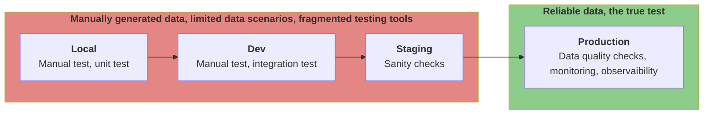
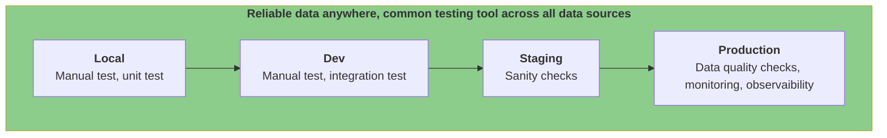

# Shifting Data Quality Left with Data Catering

## Empowering Proactive Data Management

In the ever-evolving landscape of data-driven decision-making, ensuring data quality is non-negotiable. Traditionally,
data quality has been a concern addressed late in the development lifecycle, often leading to reactive measures and
increased costs. However, a paradigm shift is underway with the adoption of a "shift left" approach, placing data
quality at the forefront of the development process.

### Today

### With Data Caterer

## Understanding the Shift Left Approach

"Shift left" is a philosophy that advocates for addressing tasks and concerns earlier in the development lifecycle.
Applied to data quality, it means tackling data issues as early as possible, ideally during the development and testing
phases. This approach aims to catch data anomalies, inaccuracies, or inconsistencies before they propagate through the
system, reducing the likelihood of downstream errors.

## Data Caterer: The Catalyst for Shifting Left

Enter Data Caterer, a metadata-driven data generation and validation tool designed to empower organizations in shifting
data quality left. By incorporating Data Caterer into the early stages of development, teams can proactively test
complex data flows, validate data sources, and ensure data quality before it reaches downstream processes.

## Key Advantages of Shifting Data Quality Left with Data Caterer

1. **Early Issue Detection**
    - Identify data quality issues early in the development process, reducing the risk of errors downstream.
2. **Proactive Validation**
    - Create production-like data scenarios, validate sources and complex flows with simplicity, promoting proactive 
      data quality.
3. **Efficient Testing Across Sources**
    - Seamlessly test data across various sources, including databases, file formats, HTTP, and messaging, all within 
      your local laptop or development environment.
    - Fast feedback loop to motivate developers to ensure thorough testing of data consumers.
4. **Integration with Development Pipelines**
    - Easily integrate Data Caterer as a task in your development pipelines, ensuring that data quality is a continuous 
      consideration rather than an isolated event.
5. **Integration with Existing Metadata**
    - By harnessing the power of existing metadata from data catalogs, schema registries, or other data validation tools,
      Data Caterer streamlines the process, automating the generation and validation of your data effortlessly.
6. **Improved Collaboration**
    - Facilitate collaboration between developers, testers, and data professionals by providing a common platform for
      early data validation.

## Realizing the Vision of Proactive Data Quality

As organizations strive for excellence in their data-driven endeavors, the shift left approach with Data Caterer
becomes a strategic imperative. By instilling a proactive data quality culture, teams can minimize the risk of costly
errors, enhance the reliability of their data, and streamline the entire development lifecycle.

In conclusion, the marriage of the shift left philosophy and Data Caterer brings forth a new era of data management,
where data quality is not just a final checkpoint but an integral part of every development milestone. Embrace the shift
left approach with Data Caterer and empower your teams to build robust, high-quality data solutions from the very
beginning.

*Shift Left, Validate Early, and Accelerate with Data Caterer.*
